# Bus Ticket Booking App (SwiftPass)

This is a simple iOS app that allows users to book bus tickets for different routes. 

## Features
- Browse available routes and select a destination
- Choose a travel date and time
- Select the number of seats and ticket class
- View ticket details and pay securely through the app
- View previous bookings and cancel tickets if needed

## Technologies Used
- Swift programming language
- Xcode IDE
- UIKit framework for building the user interface
- CoreData for local data storage
- Lottie Animations

## Installation
1. Clone the repository to your local machine.
2. Open the project in Xcode.
3. Run the app on a simulator or physical device.

## Screenshots

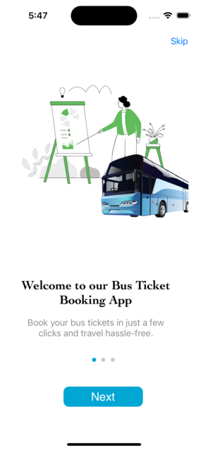

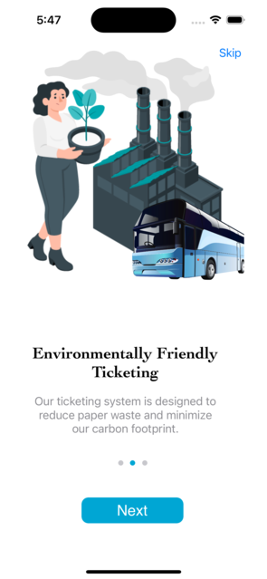

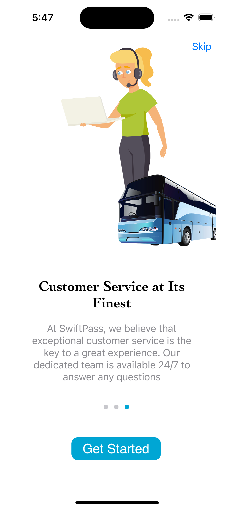

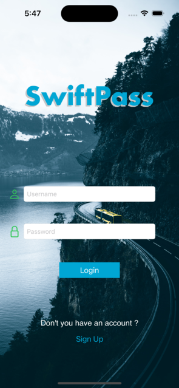

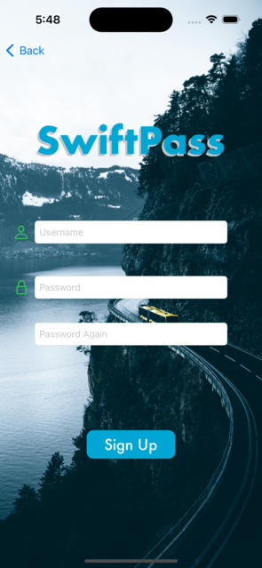

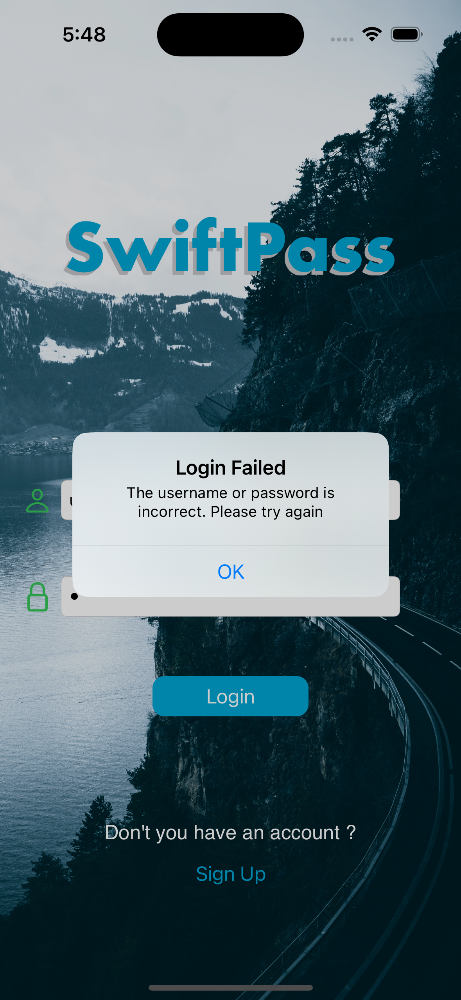

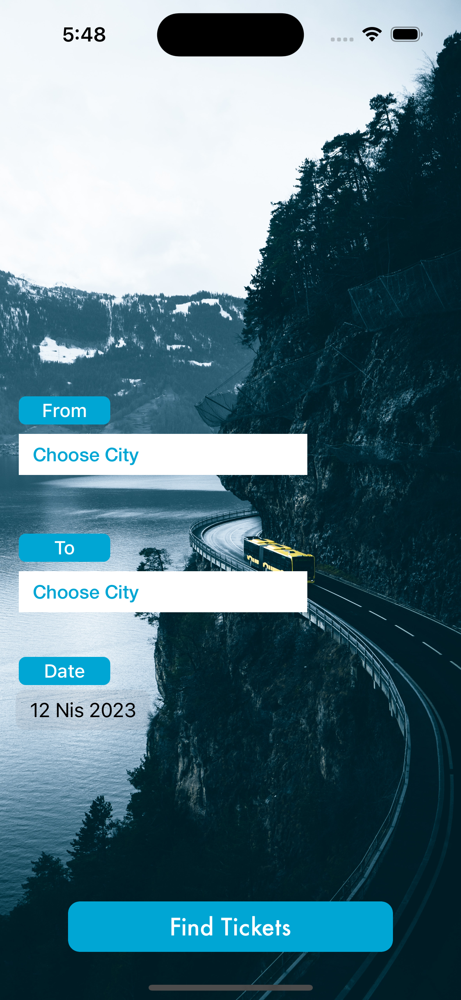

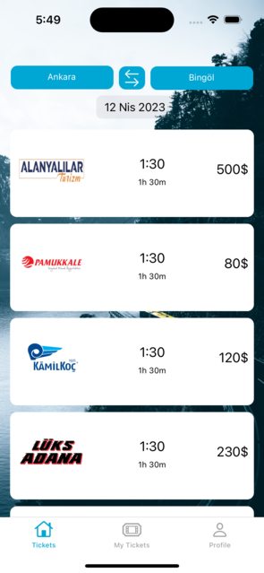

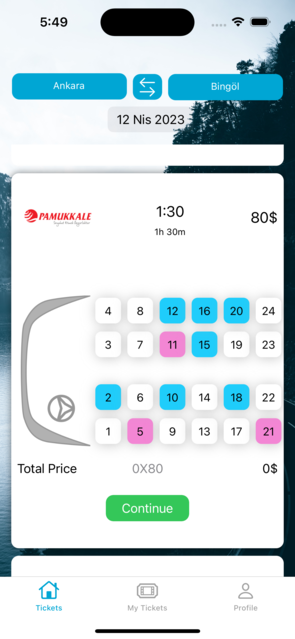

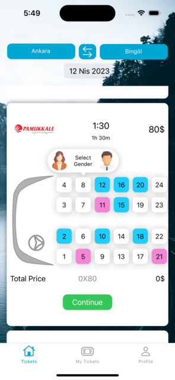

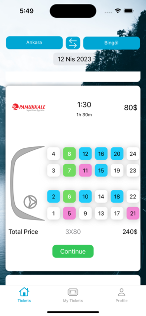

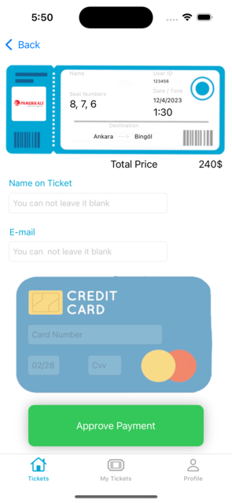

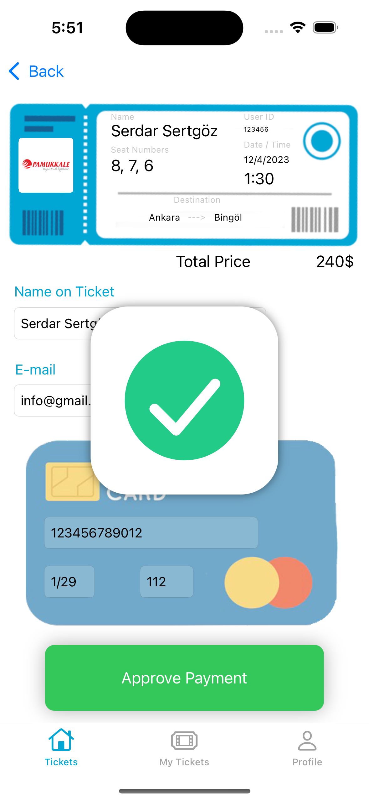

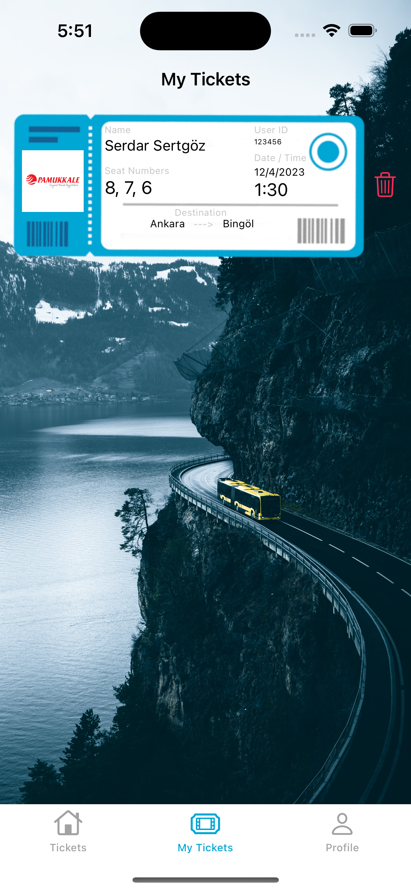

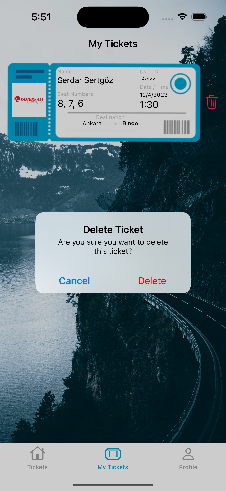

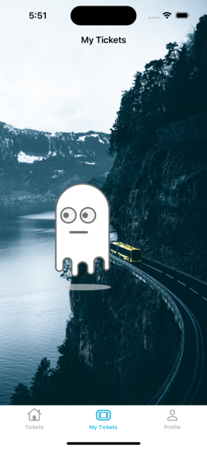

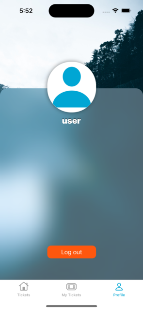

## Contributing
Contributions are welcome! Feel free to submit a pull request if you want to improve the code or add new features.

## License
This project is licensed under the MIT License.
